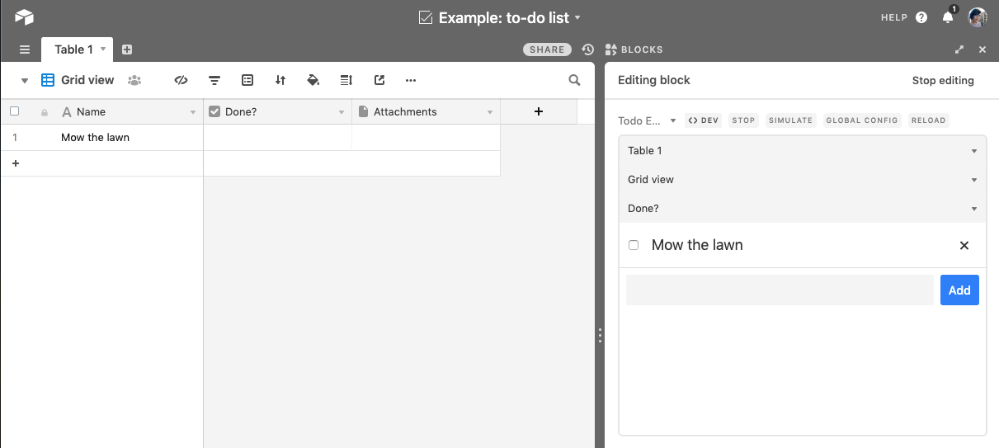

# To-do list app

This example app shows a to-do list based on the records in a table.

The code shows:

-   How to query and display data from your base.

-   How to use core Airtable functions like "expand record".

-   How to use the built-in component library to let the user choose a table.

-   How to store settings in `globalConfig`.

-   How to create, update, and delete records in your base.

-   How to make your app adapt to the current user's permissions.

## How to run this app

1. Create a new base (or you can use an existing base).

2. Create a new app in your new base (see
   [Create a new app](https://airtable.com/developers/blocks/guides/hello-world-tutorial#create-a-new-app)),
   selecting "To-do list" as your template.

3. From the root of your new app, run `block run`.

## See the app running

